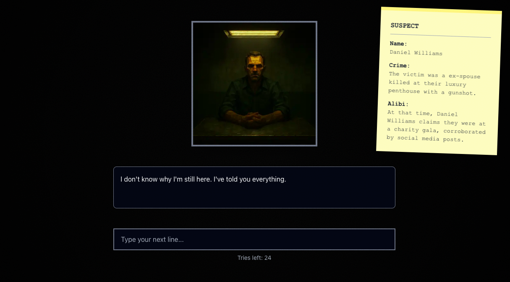

# 24 - An AI Interrogation Experience



An interactive detective game where you have 24 prompts to interrogate an AI 
suspect and extract a confession.

## 🎮 Game Overview

You play as a detective with only 24 hours (24 prompts) left to interrogate 
a murder suspect before they're released. The AI-powered suspect is confident, 
manipulative, and won't break easily. You must:

1. Establish motive
2. Prove opportunity  
3. Catch inconsistencies in their alibi
4. Make a direct accusation when the time is right

## 🚀 Quick Start

### Prerequisites

- Node.js 18+ 
- AI API key from one of:
  - **Meta Llama**: https://api.llama.com (official Llama API)
  - **Groq**: https://console.groq.com (fast inference)

### Installation

```bash
# Install dependencies
npm install

# Create environment file
cp .env.local.example .env.local

# Edit .env.local and configure your AI provider:
# AI_PROVIDER=meta (or groq)
# AI_API_KEY=your_actual_key_here

# Run development server
npm run dev
```

Open [http://localhost:3000](http://localhost:3000) to play.

## 📁 Project Structure

```
24/
├── app/
│   ├── page.tsx                # Title screen
│   ├── play/page.tsx           # Main game
│   ├── api/
│   │   ├── setup/route.ts      # Game initialization
│   │   └── interrogate/route.ts# AI interrogation endpoint
│   ├── layout.tsx
│   └── globals.css
├── components/
│   ├── TitleScreen.tsx
│   ├── GameUI.tsx
│   ├── StickyNote.tsx
│   └── Portrait.tsx
├── lib/
│   ├── ai.ts                   # Meta Llama API client
│   └── prompt.ts               # System prompt builder
└── public/portraits/           # Emotion portraits (required)
```

## 🎨 Required Assets

Place portrait images in `public/portraits/`:
- `neutral.png`
- `evasive.png`
- `defensive.png`
- `anxious.png`
- `resigned.png`
- `confessing.png`
- `smiling.png`

## 🔧 Configuration

### Environment Variables

**Required:**
- `AI_API_KEY` - Your API key (Meta Llama or Groq)

**Optional:**
- `AI_PROVIDER` - Either `meta` or `groq` (default: `meta`)
- `AI_MODEL` - Model to use (defaults to provider-specific model)

**Meta Llama Example:**
```env
AI_PROVIDER=meta
AI_MODEL=llama-3.1-8b-instruct
AI_API_KEY=your_meta_key_here
```

**Groq Example (faster inference):**
```env
AI_PROVIDER=groq
AI_MODEL=llama-3.1-8b-instant
AI_API_KEY=your_groq_key_here
```

### Security Architecture

✅ **All AI calls are SERVER-SIDE ONLY**
- API keys never exposed to client
- Calls made through Next.js API routes (`/api/interrogate`)
- Client only sends game state, never has API access

✅ **No client-side API key exposure**
- Environment variables only accessible in server components
- API routes run on Vercel's serverless functions

✅ **Input validation**
- Prompt injection detection and deflection
- Rate limiting through Vercel's built-in protection

### Deployment to Vercel

1. Push code to GitHub
2. Import project to Vercel
3. Add environment variables in Vercel dashboard
4. Deploy

## 🎯 Game Mechanics

- **Confession Progress**: 0-100 scale tracking how close suspect is to 
breaking
- **Emotions**: Suspect shows 6 different emotional states
- **Dynamic Responses**: AI adjusts based on your interrogation strategy
- **Win Condition**: Progress ≥ 96 + direct accusation
- **Lose Condition**: 24 prompts used without confession

## 🛠️ Tech Stack

- **Framework**: Next.js 14 (App Router)
- **Language**: TypeScript (Google Style Guide)
- **Styling**: Tailwind CSS
- **AI**: Meta Llama API
- **Deployment**: Vercel

## 📝 License

Created by [edgar](https://tini.la/edgar)

Powered by [Unveil Engine](https://unveilengine.com) 
and [Jupiter Wave](https://jupiterwave.games)